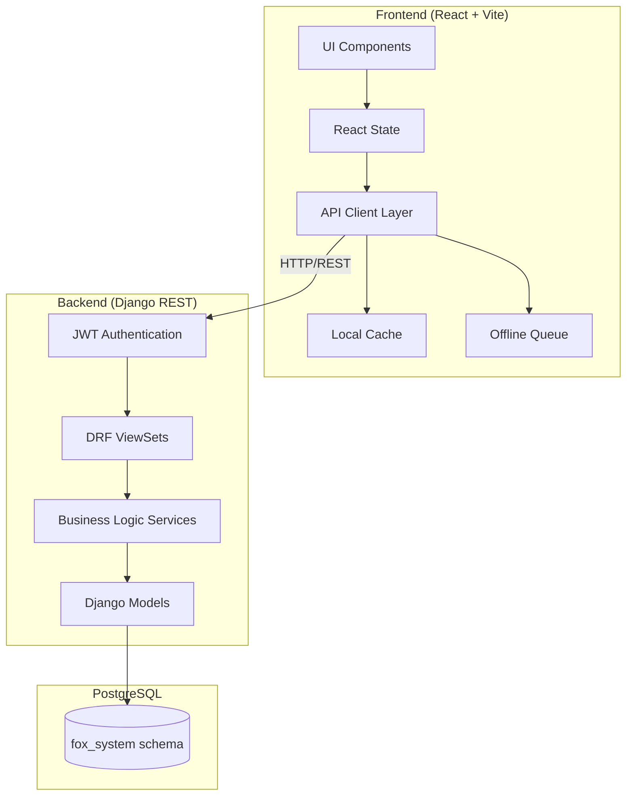
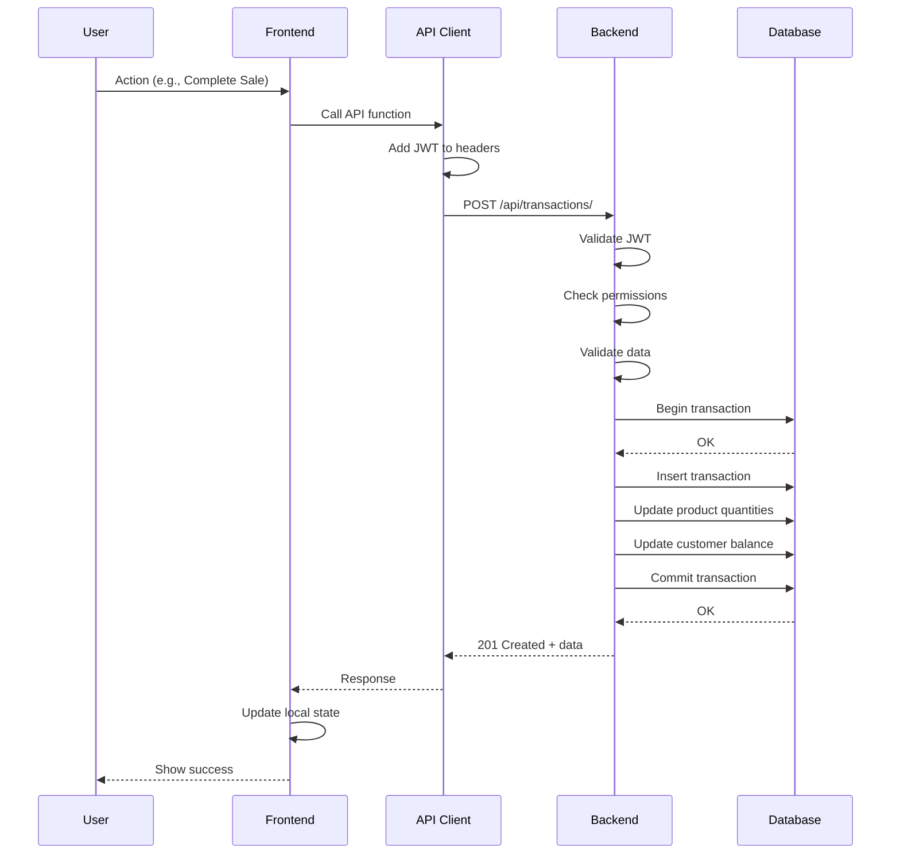

# Design Document: Fox ERP Integration

## Overview

هذا المستند يصف التصميم التقني للربط الكامل بين نظام Fox ERP (Django Backend) و (React Frontend). يشمل التصميم:
- بنية الـ API الموحدة
- نماذج البيانات
- المكونات والواجهات
- خصائص الصحة (Correctness Properties)
- استراتيجية الاختبار

## Architecture

### High-Level Architecture



### Request Flow



## Components and Interfaces

### Backend Components

#### 1. Authentication Module (`apps/api/auth/`)

```python
# JWT Authentication using djangorestframework-simplejwt
class LoginView(TokenObtainPairView):
    """POST /api/auth/login/ - Returns access and refresh tokens"""
    
class LogoutView(APIView):
    """POST /api/auth/logout/ - Blacklists refresh token"""
    
class CustomTokenObtainPairSerializer(TokenObtainPairSerializer):
    """Adds user info (id, username, name, role) to token response"""
```

#### 2. API ViewSets (`apps/api/views/`)

```python
class ProductViewSet(ModelViewSet):
    """
    GET    /api/products/           - List all products
    POST   /api/products/           - Create product
    GET    /api/products/{id}/      - Retrieve product
    PUT    /api/products/{id}/      - Update product
    DELETE /api/products/{id}/      - Delete product
    POST   /api/products/{id}/adjust_stock/ - Adjust stock
    """
    queryset = Product.objects.all()
    serializer_class = ProductSerializer
    filter_backends = [DjangoFilterBackend, SearchFilter]
    search_fields = ['name', 'sku', 'barcode']
    filterset_fields = ['category', 'is_active']
    
    @action(detail=True, methods=['post'])
    def adjust_stock(self, request, pk=None):
        """Adjust product stock with reason logging"""

class TransactionViewSet(ModelViewSet):
    """
    GET    /api/transactions/           - List transactions
    POST   /api/transactions/           - Create transaction (sale/purchase/expense)
    PUT    /api/transactions/{id}/approve/ - Approve pending transaction
    PUT    /api/transactions/{id}/reject/  - Reject pending transaction
    POST   /api/transactions/{id}/return/  - Process return
    """
    
class ShiftViewSet(ModelViewSet):
    """
    GET    /api/shifts/           - List shifts
    POST   /api/shifts/open/      - Open new shift
    POST   /api/shifts/{id}/close/ - Close shift with Z-Report
    """
```

#### 3. Business Logic Services (`apps/api/services/`)

```python
class SaleService:
    """Handles sale transaction logic"""
    
    def complete_sale(self, cart_items, customer_id, payment_method, 
                      total_amount, invoice_id=None, is_direct_sale=False):
        """
        1. Validate shift is open
        2. Validate stock availability (if not direct sale)
        3. Validate customer credit limit (if deferred)
        4. Create transaction record
        5. Update product quantities (if not direct sale)
        6. Create expense for COGS (if direct sale)
        7. Update customer balance (if deferred)
        8. Increment invoice number
        9. Log activity
        """
        
class PurchaseService:
    """Handles purchase transaction logic"""
    
    def complete_purchase(self, cart_items, supplier_id, payment_method, total_amount):
        """
        1. Create transaction record
        2. Update product quantities
        3. Calculate weighted average cost
        4. Update supplier balance (if deferred)
        5. Log activity
        """
        
class ShiftService:
    """Handles shift management logic"""
    
    def close_shift(self, shift_id, end_cash):
        """
        1. Get all transactions during shift
        2. Calculate expected cash:
           startCash + cashSales - cashReturns - cashExpenses - cashWithdrawals + cashCapital
        3. Update shift record
        4. Generate Z-Report data
        """
```

### Frontend Components

#### 1. API Client (`src/services/api.ts`)

```typescript
import axios from 'axios';

const API_BASE_URL = import.meta.env.VITE_API_URL || 'http://localhost:8000/api';

const apiClient = axios.create({
  baseURL: API_BASE_URL,
  headers: {
    'Content-Type': 'application/json',
  },
});

// Request interceptor - add JWT token
apiClient.interceptors.request.use((config) => {
  const token = localStorage.getItem('fox_erp_token');
  if (token) {
    config.headers.Authorization = `Bearer ${token}`;
  }
  return config;
});

// Response interceptor - handle errors
apiClient.interceptors.response.use(
  (response) => response,
  async (error) => {
    if (error.response?.status === 401) {
      // Token expired - redirect to login
      localStorage.removeItem('fox_erp_token');
      window.location.href = '/login';
    }
    return Promise.reject(error);
  }
);

export default apiClient;
```

#### 2. API Endpoints (`src/services/endpoints.ts`)

```typescript
import apiClient from './api';
import { Product, Customer, Supplier, Transaction, Shift, Quotation, AppSettings, User } from '../types';

// Products API
export const productsAPI = {
  list: (params?: { category?: string; search?: string }) => 
    apiClient.get<Product[]>('/products/', { params }),
  create: (data: Omit<Product, 'id'>) => 
    apiClient.post<Product>('/products/', data),
  update: (id: number, data: Partial<Product>) => 
    apiClient.put<Product>(`/products/${id}/`, data),
  delete: (id: number) => 
    apiClient.delete(`/products/${id}/`),
  adjustStock: (id: number, data: { quantity_diff: number; reason: string }) => 
    apiClient.post(`/products/${id}/adjust_stock/`, data),
};

// Transactions API
export const transactionsAPI = {
  list: (params?: { type?: string; status?: string; from_date?: string; to_date?: string }) => 
    apiClient.get<Transaction[]>('/transactions/', { params }),
  createSale: (data: SaleRequest) => 
    apiClient.post<Transaction>('/transactions/', { ...data, type: 'sale' }),
  createPurchase: (data: PurchaseRequest) => 
    apiClient.post<Transaction>('/transactions/', { ...data, type: 'purchase' }),
  createExpense: (data: ExpenseRequest) => 
    apiClient.post<Transaction>('/transactions/', { ...data, type: 'expense' }),
  approve: (id: string) => 
    apiClient.put(`/transactions/${id}/approve/`),
  reject: (id: string) => 
    apiClient.put(`/transactions/${id}/reject/`),
  return: (id: string) => 
    apiClient.post(`/transactions/${id}/return/`),
};

// Shifts API
export const shiftsAPI = {
  list: () => apiClient.get<Shift[]>('/shifts/'),
  open: (startCash: number) => 
    apiClient.post<Shift>('/shifts/open/', { start_cash: startCash }),
  close: (id: number, endCash: number) => 
    apiClient.post<Shift>(`/shifts/${id}/close/`, { end_cash: endCash }),
};

// Auth API
export const authAPI = {
  login: (username: string, password: string) => 
    apiClient.post<{ access: string; refresh: string; user: User }>('/auth/login/', { username, password }),
  logout: () => 
    apiClient.post('/auth/logout/'),
};

// System API
export const systemAPI = {
  backup: () => apiClient.post('/system/backup/', {}, { responseType: 'blob' }),
  restore: (file: File) => {
    const formData = new FormData();
    formData.append('file', file);
    return apiClient.post('/system/restore/', formData);
  },
  clearTransactions: () => apiClient.post('/system/clear_transactions/'),
  factoryReset: () => apiClient.post('/system/factory_reset/'),
};
```

#### 3. Offline Queue (`src/services/offline.ts`)

```typescript
interface PendingTransaction {
  id: string;
  timestamp: string;
  type: 'sale' | 'purchase' | 'expense';
  data: any;
  status: 'pending_sync' | 'syncing' | 'failed';
}

class OfflineQueue {
  private queue: PendingTransaction[] = [];
  
  constructor() {
    this.loadFromStorage();
    window.addEventListener('online', () => this.syncAll());
  }
  
  add(type: string, data: any): string {
    const item: PendingTransaction = {
      id: `offline-${Date.now()}`,
      timestamp: new Date().toISOString(),
      type: type as any,
      data,
      status: 'pending_sync',
    };
    this.queue.push(item);
    this.saveToStorage();
    return item.id;
  }
  
  async syncAll(): Promise<void> {
    const pending = this.queue.filter(t => t.status === 'pending_sync');
    for (const item of pending) {
      try {
        item.status = 'syncing';
        await this.syncItem(item);
        this.remove(item.id);
      } catch (error) {
        item.status = 'failed';
      }
    }
    this.saveToStorage();
  }
}
```

## Data Models

### Backend Models (Django)

```python
# apps/api/models.py

from django.db import models
from django.contrib.auth.models import AbstractUser

class User(AbstractUser):
    ROLE_CHOICES = [
        ('admin', 'مدير'),
        ('accountant', 'محاسب'),
        ('cashier', 'كاشير'),
        ('stock_keeper', 'أمين مخزن'),
    ]
    role = models.CharField(max_length=20, choices=ROLE_CHOICES, default='cashier')
    name = models.CharField(max_length=200, blank=True)

class Product(models.Model):
    UNIT_CHOICES = [
        ('قطعة', 'قطعة'),
        ('متر', 'متر'),
        ('كرتونة', 'كرتونة'),
    ]
    sku = models.CharField(max_length=100, unique=True)
    barcode = models.CharField(max_length=100, unique=True, blank=True, null=True)
    name = models.CharField(max_length=300)
    category = models.CharField(max_length=100, blank=True)
    quantity = models.DecimalField(max_digits=10, decimal_places=2, default=0)
    cost_price = models.DecimalField(max_digits=12, decimal_places=2, default=0)
    sell_price = models.DecimalField(max_digits=12, decimal_places=2, default=0)
    unit = models.CharField(max_length=50, choices=UNIT_CHOICES, default='قطعة')
    min_stock_alert = models.DecimalField(max_digits=10, decimal_places=2, default=0)
    image = models.URLField(blank=True, null=True)
    is_active = models.BooleanField(default=True)
    created_at = models.DateTimeField(auto_now_add=True)
    updated_at = models.DateTimeField(auto_now=True)

class Customer(models.Model):
    TYPE_CHOICES = [
        ('consumer', 'مستهلك'),
        ('business', 'تجاري'),
    ]
    name = models.CharField(max_length=200)
    phone = models.CharField(max_length=20, blank=True)
    type = models.CharField(max_length=20, choices=TYPE_CHOICES, default='consumer')
    balance = models.DecimalField(max_digits=12, decimal_places=2, default=0)
    credit_limit = models.DecimalField(max_digits=12, decimal_places=2, default=0)
    is_active = models.BooleanField(default=True)
    created_at = models.DateTimeField(auto_now_add=True)

class Supplier(models.Model):
    name = models.CharField(max_length=200)
    phone = models.CharField(max_length=20, blank=True)
    balance = models.DecimalField(max_digits=12, decimal_places=2, default=0)
    is_active = models.BooleanField(default=True)
    created_at = models.DateTimeField(auto_now_add=True)

class Transaction(models.Model):
    TYPE_CHOICES = [
        ('بيع', 'بيع'),
        ('شراء', 'شراء'),
        ('مصروف', 'مصروف'),
        ('مرتجع', 'مرتجع'),
        ('تسوية مخزون', 'تسوية مخزون'),
        ('إيداع رأس مال', 'إيداع رأس مال'),
        ('مسحوبات شخصية', 'مسحوبات شخصية'),
    ]
    PAYMENT_CHOICES = [
        ('كاش', 'كاش'),
        ('محفظة', 'محفظة'),
        ('Instapay', 'Instapay'),
        ('آجل', 'آجل'),
    ]
    STATUS_CHOICES = [
        ('pending', 'معلق'),
        ('completed', 'مكتمل'),
        ('rejected', 'مرفوض'),
    ]
    
    id = models.CharField(max_length=50, primary_key=True)
    type = models.CharField(max_length=50, choices=TYPE_CHOICES)
    date = models.DateTimeField(auto_now_add=True)
    amount = models.DecimalField(max_digits=12, decimal_places=2)
    payment_method = models.CharField(max_length=50, choices=PAYMENT_CHOICES)
    description = models.TextField(blank=True)
    category = models.CharField(max_length=100, blank=True, null=True)
    related_customer = models.ForeignKey(Customer, on_delete=models.SET_NULL, null=True, blank=True)
    related_supplier = models.ForeignKey(Supplier, on_delete=models.SET_NULL, null=True, blank=True)
    items = models.JSONField(default=list)  # CartItem[]
    status = models.CharField(max_length=20, choices=STATUS_CHOICES, default='completed')
    due_date = models.DateField(null=True, blank=True)
    is_direct_sale = models.BooleanField(default=False)
    shift = models.ForeignKey('Shift', on_delete=models.SET_NULL, null=True, blank=True)
    created_by = models.ForeignKey(User, on_delete=models.SET_NULL, null=True)

class Shift(models.Model):
    STATUS_CHOICES = [
        ('open', 'مفتوحة'),
        ('closed', 'مغلقة'),
    ]
    user = models.ForeignKey(User, on_delete=models.CASCADE)
    start_time = models.DateTimeField(auto_now_add=True)
    end_time = models.DateTimeField(null=True, blank=True)
    start_cash = models.DecimalField(max_digits=12, decimal_places=2)
    end_cash = models.DecimalField(max_digits=12, decimal_places=2, null=True)
    expected_cash = models.DecimalField(max_digits=12, decimal_places=2, null=True)
    total_sales = models.DecimalField(max_digits=12, decimal_places=2, null=True)
    sales_by_method = models.JSONField(default=dict)  # {PaymentMethod: amount}
    status = models.CharField(max_length=20, choices=STATUS_CHOICES, default='open')

class Quotation(models.Model):
    STATUS_CHOICES = [
        ('pending', 'معلق'),
        ('converted', 'محول'),
    ]
    id = models.CharField(max_length=50, primary_key=True)
    date = models.DateTimeField(auto_now_add=True)
    customer = models.ForeignKey(Customer, on_delete=models.CASCADE)
    items = models.JSONField(default=list)  # CartItem[]
    total_amount = models.DecimalField(max_digits=12, decimal_places=2)
    status = models.CharField(max_length=20, choices=STATUS_CHOICES, default='pending')

class AppSettings(models.Model):
    """Singleton model for application settings"""
    company_name = models.CharField(max_length=200, default='FOX GROUP')
    company_phone = models.CharField(max_length=20, default='')
    company_address = models.TextField(default='')
    logo_url = models.URLField(blank=True, null=True)
    auto_print = models.BooleanField(default=False)
    next_invoice_number = models.IntegerField(default=1001)
    opening_balance = models.DecimalField(max_digits=12, decimal_places=2, default=0)
    tax_rate = models.DecimalField(max_digits=5, decimal_places=2, default=14)
    current_shift = models.ForeignKey(Shift, on_delete=models.SET_NULL, null=True, blank=True)
    prevent_negative_stock = models.BooleanField(default=False)
    invoice_terms = models.TextField(default='')
    
    class Meta:
        verbose_name = 'App Settings'
        verbose_name_plural = 'App Settings'
    
    def save(self, *args, **kwargs):
        self.pk = 1  # Ensure singleton
        super().save(*args, **kwargs)

class ActivityLog(models.Model):
    date = models.DateTimeField(auto_now_add=True)
    user = models.ForeignKey(User, on_delete=models.SET_NULL, null=True)
    user_name = models.CharField(max_length=200)
    action = models.CharField(max_length=100)
    details = models.TextField()
```


### API Response Format

```typescript
// Success Response
interface SuccessResponse<T> {
  data: T;
  message?: string;
}

// Error Response
interface ErrorResponse {
  error_code: string;
  message: string;
  details?: Record<string, string[]>;
}

// Standard Error Codes
enum ErrorCode {
  VALIDATION_ERROR = 'VALIDATION_ERROR',
  AUTH_FAILED = 'AUTH_FAILED',
  PERMISSION_DENIED = 'PERMISSION_DENIED',
  NOT_FOUND = 'NOT_FOUND',
  BUSINESS_RULE_VIOLATION = 'BUSINESS_RULE_VIOLATION',
  SERVER_ERROR = 'SERVER_ERROR',
  SHIFT_NOT_OPEN = 'SHIFT_NOT_OPEN',
  INSUFFICIENT_STOCK = 'INSUFFICIENT_STOCK',
  CREDIT_LIMIT_EXCEEDED = 'CREDIT_LIMIT_EXCEEDED',
  DUPLICATE_ENTRY = 'DUPLICATE_ENTRY',
}
```

## Correctness Properties

*A property is a characteristic or behavior that should hold true across all valid executions of a system-essentially, a formal statement about what the system should do. Properties serve as the bridge between human-readable specifications and machine-verifiable correctness guarantees.*

Based on the prework analysis, the following correctness properties have been identified:

### Property 1: JWT Token Inclusion
*For any* authenticated API request, the Authorization header SHALL contain a valid JWT token in the format "Bearer {token}"
**Validates: Requirements 1.2**

### Property 2: Error Response Format
*For any* API error response, the response body SHALL contain error_code, message, and optionally details fields
**Validates: Requirements 26.1**

### Property 3: Product CRUD Round-Trip
*For any* valid product data, creating a product and then retrieving it SHALL return equivalent data (excluding auto-generated fields like id, created_at)
**Validates: Requirements 3.2, 3.3**

### Property 4: Product Deletion with Transactions
*For any* product that has associated transactions, attempting to delete it SHALL fail with error_code 'BUSINESS_RULE_VIOLATION'
**Validates: Requirements 3.5**

### Property 5: Customer CRUD Round-Trip
*For any* valid customer data, creating a customer and then retrieving it SHALL return equivalent data
**Validates: Requirements 4.2, 4.3**

### Property 6: Customer Deletion with Balance
*For any* customer with non-zero balance, attempting to delete it SHALL fail with error_code 'BUSINESS_RULE_VIOLATION'
**Validates: Requirements 4.5**

### Property 7: Sale Transaction Atomicity
*For any* completed sale transaction, the following invariants SHALL hold:
- Transaction record exists with correct amount
- Product quantities decreased by cart quantities (unless direct sale)
- Customer balance decreased by amount (if deferred payment)
**Validates: Requirements 6.1, 6.3**

### Property 8: Direct Sale Inventory Invariant
*For any* sale completed with is_direct_sale=true, product quantities SHALL remain unchanged AND an expense transaction for COGS SHALL be created
**Validates: Requirements 6.2**

### Property 9: Credit Limit Enforcement
*For any* deferred sale where (customer.balance - sale_amount) < -customer.credit_limit, the sale SHALL be rejected with error_code 'CREDIT_LIMIT_EXCEEDED'
**Validates: Requirements 6.4, 24.5**

### Property 10: Sale Return Inverse
*For any* sale transaction that is returned, the product quantities SHALL be restored (unless direct sale) AND customer balance SHALL be adjusted inversely
**Validates: Requirements 6.5**

### Property 11: Shift Requirement for Sales
*For any* sale attempted when no shift is open (settings.current_shift_id is null), the sale SHALL be rejected with error_code 'SHIFT_NOT_OPEN'
**Validates: Requirements 6.6**

### Property 12: Purchase Average Cost Calculation
*For any* purchase of quantity Q at cost C for a product with existing quantity Q0 and cost C0, the new average cost SHALL equal (Q0 × C0 + Q × C) / (Q0 + Q)
**Validates: Requirements 7.4**

### Property 13: Shift Expected Cash Calculation
*For any* closed shift, expected_cash SHALL equal: start_cash + sum(cash_sales) - sum(cash_returns) - sum(cash_expenses) - sum(cash_withdrawals) + sum(cash_capital)
**Validates: Requirements 8.2, 8.6**

### Property 14: Single Open Shift
*For any* attempt to open a shift when another shift is already open, the request SHALL be rejected with error_code 'BUSINESS_RULE_VIOLATION'
**Validates: Requirements 8.4**

### Property 15: Expense Approval Threshold
*For any* expense transaction with amount > 2000 created by a non-admin user, the transaction status SHALL be 'pending'
**Validates: Requirements 9.2**

### Property 16: Debt Settlement Balance Update
*For any* customer debt settlement of amount A, the customer balance SHALL increase by A
**Validates: Requirements 10.1**

### Property 17: Stock Adjustment Quantity Update
*For any* stock adjustment with quantity_diff D for product P, the product quantity SHALL change by exactly D
**Validates: Requirements 11.1**

### Property 18: Negative Stock Prevention
*For any* stock adjustment that would result in negative quantity when prevent_negative_stock is enabled, the adjustment SHALL be rejected
**Validates: Requirements 11.2, 24.1**

### Property 19: Quotation Conversion
*For any* quotation that is converted to invoice, a sale transaction SHALL be created with the same items and total_amount, AND quotation status SHALL become 'converted'
**Validates: Requirements 12.2, 12.4**

### Property 20: Backup Round-Trip
*For any* system backup followed by restore, all data (products, customers, suppliers, transactions, settings) SHALL be equivalent to the original state
**Validates: Requirements 14.1, 14.3**

### Property 21: Barcode Uniqueness
*For any* product with a barcode, no other product SHALL have the same barcode value
**Validates: Requirements 25.5**

### Property 22: Barcode Search
*For any* valid barcode that matches a product, searching by that barcode SHALL return exactly that product
**Validates: Requirements 25.1**

### Property 23: Consumer Deferred Payment Prevention
*For any* sale with deferred payment to a customer with type='consumer', the sale SHALL be rejected with error_code 'BUSINESS_RULE_VIOLATION'
**Validates: Requirements 24.2**

### Property 24: Role-Based Access Control
*For any* API request to admin-only endpoints by a non-admin user, the request SHALL be rejected with status 403 and error_code 'PERMISSION_DENIED'
**Validates: Requirements 2.2, 20.5**

## Error Handling

### Backend Error Handler

```python
# apps/api/exceptions.py
from rest_framework.views import exception_handler
from rest_framework.response import Response

class BusinessRuleViolation(Exception):
    def __init__(self, message, error_code='BUSINESS_RULE_VIOLATION'):
        self.message = message
        self.error_code = error_code

def custom_exception_handler(exc, context):
    response = exception_handler(exc, context)
    
    if isinstance(exc, BusinessRuleViolation):
        return Response({
            'error_code': exc.error_code,
            'message': exc.message,
        }, status=400)
    
    if response is not None:
        error_code = 'SERVER_ERROR'
        if response.status_code == 400:
            error_code = 'VALIDATION_ERROR'
        elif response.status_code == 401:
            error_code = 'AUTH_FAILED'
        elif response.status_code == 403:
            error_code = 'PERMISSION_DENIED'
        elif response.status_code == 404:
            error_code = 'NOT_FOUND'
            
        response.data = {
            'error_code': error_code,
            'message': str(response.data) if isinstance(response.data, str) else 'خطأ في الطلب',
            'details': response.data if isinstance(response.data, dict) else None,
        }
    
    return response
```

### Frontend Error Handler

```typescript
// src/services/errorHandler.ts
import { AxiosError } from 'axios';

interface APIError {
  error_code: string;
  message: string;
  details?: Record<string, string[]>;
}

const ERROR_MESSAGES: Record<string, string> = {
  VALIDATION_ERROR: 'خطأ في البيانات المدخلة',
  AUTH_FAILED: 'فشل في تسجيل الدخول',
  PERMISSION_DENIED: 'ليس لديك صلاحية لهذه العملية',
  NOT_FOUND: 'العنصر غير موجود',
  BUSINESS_RULE_VIOLATION: 'لا يمكن إتمام العملية',
  SERVER_ERROR: 'حدث خطأ في الخادم',
  SHIFT_NOT_OPEN: 'يجب فتح الوردية أولاً',
  INSUFFICIENT_STOCK: 'الكمية غير متوفرة في المخزون',
  CREDIT_LIMIT_EXCEEDED: 'تم تجاوز حد الائتمان',
  NETWORK_ERROR: 'خطأ في الاتصال بالشبكة',
};

export function handleAPIError(error: AxiosError<APIError>): string {
  if (!error.response) {
    return ERROR_MESSAGES.NETWORK_ERROR;
  }
  
  const { error_code, message } = error.response.data;
  return message || ERROR_MESSAGES[error_code] || ERROR_MESSAGES.SERVER_ERROR;
}
```

## Testing Strategy

### Dual Testing Approach

The system will use both unit tests and property-based tests:

1. **Unit Tests**: Verify specific examples, edge cases, and error conditions
2. **Property-Based Tests**: Verify universal properties that should hold across all inputs

### Backend Testing (Python/pytest)

**Testing Framework**: pytest + hypothesis (for property-based testing)

```python
# tests/test_properties.py
from hypothesis import given, strategies as st
from decimal import Decimal

class TestProductProperties:
    """
    **Feature: fox-erp-integration, Property 3: Product CRUD Round-Trip**
    **Validates: Requirements 3.2, 3.3**
    """
    @given(
        name=st.text(min_size=1, max_size=100),
        sku=st.text(min_size=1, max_size=50, alphabet=st.characters(whitelist_categories=('L', 'N'))),
        cost_price=st.decimals(min_value=0.01, max_value=10000, places=2),
        sell_price=st.decimals(min_value=0.01, max_value=10000, places=2),
        quantity=st.decimals(min_value=0, max_value=10000, places=2),
    )
    def test_product_crud_round_trip(self, name, sku, cost_price, sell_price, quantity):
        """Creating and retrieving a product should return equivalent data"""
        product_data = {
            'name': name,
            'sku': sku,
            'cost_price': str(cost_price),
            'sell_price': str(sell_price),
            'quantity': str(quantity),
        }
        
        # Create
        response = self.client.post('/api/products/', product_data)
        assert response.status_code == 201
        created_id = response.data['id']
        
        # Retrieve
        response = self.client.get(f'/api/products/{created_id}/')
        assert response.status_code == 200
        
        # Verify equivalence
        assert response.data['name'] == name
        assert response.data['sku'] == sku
        assert Decimal(response.data['cost_price']) == cost_price
        assert Decimal(response.data['sell_price']) == sell_price

class TestSaleProperties:
    """
    **Feature: fox-erp-integration, Property 12: Purchase Average Cost Calculation**
    **Validates: Requirements 7.4**
    """
    @given(
        old_qty=st.decimals(min_value=1, max_value=1000, places=2),
        old_cost=st.decimals(min_value=0.01, max_value=1000, places=2),
        new_qty=st.decimals(min_value=1, max_value=1000, places=2),
        new_cost=st.decimals(min_value=0.01, max_value=1000, places=2),
    )
    def test_average_cost_calculation(self, old_qty, old_cost, new_qty, new_cost):
        """Average cost should follow the weighted average formula"""
        expected_avg = (old_qty * old_cost + new_qty * new_cost) / (old_qty + new_qty)
        
        # Setup product with initial quantity and cost
        product = Product.objects.create(
            name='Test', sku='TEST', quantity=old_qty, cost_price=old_cost, sell_price=100
        )
        
        # Complete purchase
        purchase_service = PurchaseService()
        purchase_service.complete_purchase(
            cart_items=[{'id': product.id, 'quantity': new_qty, 'cost_price': new_cost}],
            supplier_id=1,
            payment_method='كاش',
            total_amount=new_qty * new_cost
        )
        
        # Verify
        product.refresh_from_db()
        assert abs(product.cost_price - expected_avg) < Decimal('0.01')

class TestShiftProperties:
    """
    **Feature: fox-erp-integration, Property 13: Shift Expected Cash Calculation**
    **Validates: Requirements 8.2, 8.6**
    """
    @given(
        start_cash=st.decimals(min_value=0, max_value=10000, places=2),
        cash_sales=st.lists(st.decimals(min_value=0.01, max_value=1000, places=2), max_size=10),
        cash_expenses=st.lists(st.decimals(min_value=0.01, max_value=500, places=2), max_size=5),
    )
    def test_shift_expected_cash(self, start_cash, cash_sales, cash_expenses):
        """Expected cash should equal start + sales - expenses"""
        expected = start_cash + sum(cash_sales) - sum(cash_expenses)
        
        # Open shift
        shift = Shift.objects.create(user_id=1, start_cash=start_cash, status='open')
        
        # Create transactions
        for amount in cash_sales:
            Transaction.objects.create(
                type='بيع', amount=amount, payment_method='كاش', 
                shift=shift, status='completed'
            )
        for amount in cash_expenses:
            Transaction.objects.create(
                type='مصروف', amount=amount, payment_method='كاش',
                shift=shift, status='completed'
            )
        
        # Close shift
        shift_service = ShiftService()
        result = shift_service.close_shift(shift.id, end_cash=expected)
        
        assert abs(result.expected_cash - expected) < Decimal('0.01')
```

### Frontend Testing (TypeScript/Vitest)

**Testing Framework**: Vitest + fast-check (for property-based testing)

```typescript
// src/__tests__/properties.test.ts
import { describe, it, expect } from 'vitest';
import * as fc from 'fast-check';

describe('API Client Properties', () => {
  /**
   * **Feature: fox-erp-integration, Property 1: JWT Token Inclusion**
   * **Validates: Requirements 1.2**
   */
  it('should include JWT token in all authenticated requests', () => {
    fc.assert(
      fc.property(
        fc.string({ minLength: 10, maxLength: 200 }), // token
        fc.constantFrom('GET', 'POST', 'PUT', 'DELETE'), // method
        fc.webUrl(), // url
        (token, method, url) => {
          localStorage.setItem('fox_erp_token', token);
          
          const config = apiClient.interceptors.request.handlers[0].fulfilled({
            method,
            url,
            headers: {},
          });
          
          expect(config.headers.Authorization).toBe(`Bearer ${token}`);
        }
      ),
      { numRuns: 100 }
    );
  });
});

describe('Business Logic Properties', () => {
  /**
   * **Feature: fox-erp-integration, Property 9: Credit Limit Enforcement**
   * **Validates: Requirements 6.4, 24.5**
   */
  it('should reject deferred sales exceeding credit limit', () => {
    fc.assert(
      fc.property(
        fc.nat({ max: 10000 }), // credit limit
        fc.nat({ max: 5000 }), // current balance (negative = debt)
        fc.nat({ max: 10000 }), // sale amount
        (creditLimit, currentBalance, saleAmount) => {
          const customer = { creditLimit, balance: -currentBalance };
          const newBalance = customer.balance - saleAmount;
          
          const shouldReject = newBalance < -creditLimit;
          const result = validateDeferredSale(customer, saleAmount);
          
          expect(result.rejected).toBe(shouldReject);
          if (shouldReject) {
            expect(result.error_code).toBe('CREDIT_LIMIT_EXCEEDED');
          }
        }
      ),
      { numRuns: 100 }
    );
  });
});
```

### Test Coverage Requirements

- Minimum 70% code coverage for both backend and frontend
- All correctness properties must have corresponding property-based tests
- Critical paths (sale, purchase, shift close) must have integration tests
- Each property-based test should run minimum 100 iterations

---

**Document Version:** 1.0  
**Last Updated:** 2025-12-04  
**Status:** Ready for Review
